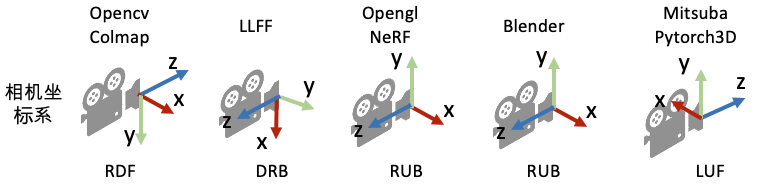

`get_default_aabb`

```python
def get_default_aabb(args, cameras, xyz_org, scale=1.0):
    torch.cuda.empty_cache()
    # 这里的c2ws是未经过转置的
    c2ws = np.array([np.linalg.inv(np.asarray((loadCam_woImage(args, idx, cam, scale).world_view_transform.T).cpu().numpy())) for idx, cam in enumerate(cameras)])
    # 调转了y和z的方向

    poses = c2ws[:,:3,:] @ np.diag([1, -1, -1, 1])
    center = (focus_point_fn(poses))
    radius = torch.tensor(np.median(np.abs(c2ws[:,:3,3] - center), axis=0), device=xyz_org.device)
    center = torch.from_numpy(center).float().to(xyz_org.device)
    if radius.min() / radius.max() < 0.02:
        # If the radius is too small, we don't contract in this dimension
        radius[torch.argmin(radius)] = 0.5 * (xyz_org[:, torch.argmin(radius)].max() - xyz_org[:, torch.argmin(radius)].min())
    aabb = torch.zeros(6, device=xyz_org.device)
    aabb[:3] = center - radius
    aabb[3:] = center + radius

    return aabb

def focus_point_fn(poses: np.ndarray) -> np.ndarray:
    """Calculate nearest point to all focal axes in poses."""
    directions, origins = poses[:, :3, 2:3], poses[:, :3, 3:4]
    m = np.eye(3) - directions * np.transpose(directions, [0, 2, 1]) # (N, 3, 3)
    mt_m = np.transpose(m, [0, 2, 1]) @ m
    focus_pt = np.linalg.inv(mt_m.mean(0)) @ (mt_m @ origins).mean(0)[:, 0]
    return focus_pt
```


- c2w的前3列可以看做世界坐标系中相机x/y/z轴的方向，第4列看做相机中心
- directions, origins分别表示z轴方向和中心坐标
- focus_point_fn求解一个点，与从N个点出发N个方向射线的距离和最近

contract操作是可逆的，假定点为$x$，使用p-范数：
contract的公式为
$$
x^\prime 
= \left(2-\frac{1}{{\Vert x \Vert}_p}\right) \frac{x}{{\Vert x \Vert}_p}
$$
那么对$x^\prime$也取p-范数，则有：
$$
{\Vert x^\prime \Vert}_p 
= \frac{1}{{\Vert x \Vert}_p}\left(2-\frac{1}{{\Vert x \Vert}_p}\right){\Vert x \Vert}_p 
= 2-\frac{1}{{\Vert x \Vert}_p}
$$
将${\Vert x \Vert}_p$按${\Vert x^\prime \Vert}_p$代回原式，则有
$$
x 
= x^\prime \cdot \frac{{\Vert x \Vert}_p^2}{2{\Vert x \Vert}_p - 1}
= x^\prime \cdot \frac{1}{\Vert x^\prime \Vert\left(2-{\Vert x^\prime \Vert}_p\right)}
$$
